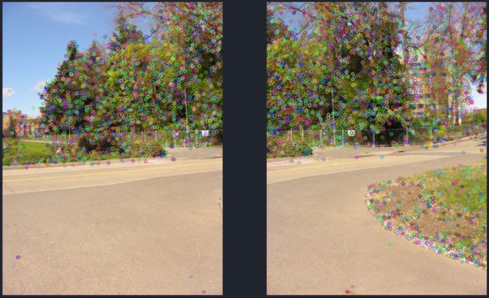
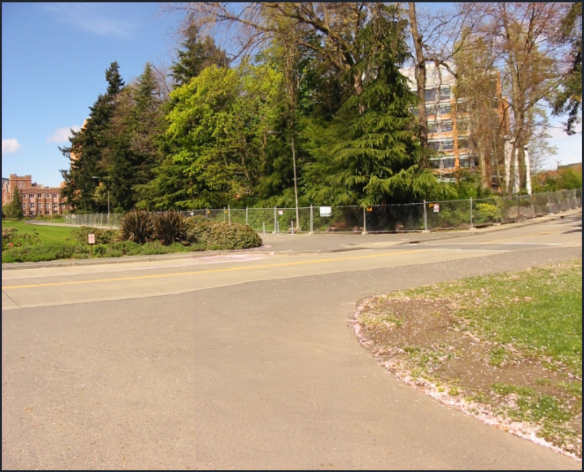

<!-- ABOUT THE PROJECT -->
## About The Project

Panorama composition using SIFT Features and a custom implementaion of RANSAC algorithm (Random Sample Consensus).

Author:
* Andreas Panayiotou

## Prerequisites

Below are shown the necessary python libraries to run the project. 
* OpenCV
  ```sh
  pip install opencv-python
  ```
* Matplotlib
  ```sh
  pip install matplotlib
  ```
* NumPy
  ```sh
  pip install numpy
  ```
## Results
Feature Extraction        |
:------------------------:|
  |
Feature Matching |
 |
Outliers Removal |
 |
Image  Stitching |
 |
